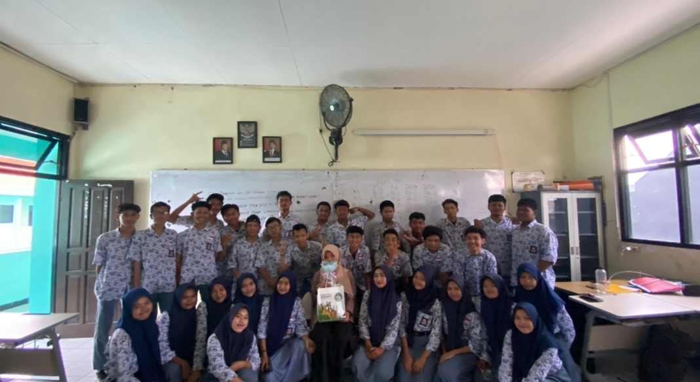

<!DOCTYPE html>
<html lang="id">
<head>
  <meta charset="UTF-8" />
  <meta name="viewport" content="width=device-width, initial-scale=1.0"/>
  <title>Website Kelas XI TKJ 1</title>
  
</head>
<body>
  <header>
    <h1>Kelas XI TKJ 1</h1>
  </header>

  <section>
    

      <h2>Tentang Kelas</h2>
      
      
Deskripsi Kelas: Kelas ini adalah tempat untuk belajar berbagai mata pelajaran dan tempat untuk mengasah skill terkait Teknik Komputer Jaringan (TKJ)

      <h3>Guru Pembimbing</h3>
      <ul>
        <li><strong>Bahasa Indonesia:</strong> Pak Dimas</li>
        <li><strong>MP-Bil:</strong> Pak Dimas</li>
        <li><strong>Agama Islam:</strong> Pak Zainal</li>
        <li><strong>Praktek:</strong> Pak Sigit</li>
        <li><strong>PKK:</strong> Pak Ulil</li>
        <li><strong>Sejarah:</strong> Pak Selamet</li>
        <li><strong>KK-Tkj(1):</strong> Bu Fitria</li>
        <li><strong>KK-Tkj(2):</strong> Bu Yulia</li>
        <li><strong>MP-Tkj:</strong> Bu Yulia</li>
        <li><strong>Matematika:</strong> Bu Rose</li>
        <li><strong>Bahasa Jawa:</strong> Bu Aulia</li>
        <li><strong>Bahasa Inggris:</strong> Bu Laili</li>
        <li><strong>BK:</strong> Bu Lilik</li>
      </ul>
      <h3>Kontak</h3>
      
<strong>Nama Sekolah:</strong> SMK Antartika Surabaya

      
<strong>Alamat Sekolah:</strong> Jl. Banyu Urip Kidul Gg.II No.37

      
<strong>Nomor Telepon:</strong> (031) 5611101

      
<strong>Email:</strong> smkantartikasurabaya@gmail.com

      
<strong>Media Sosial:</strong> IG: @smkantartikasurabaya

      <h1>Pengantar Wali Kelas – Bu Yulia</h1>
    
Assalamu’alaikum warahmatullahi wabarakatuh,

    
Salam sejahtera untuk kita semua.

    
Puji syukur kita panjatkan ke hadirat Tuhan Yang Maha Esa atas limpahan rahmat dan karunia-Nya, sehingga kita semua dapat menjalani tahun ajaran ini dengan penuh semangat dan kebersamaan.

    
Saya, Bu Yulia, selaku wali kelas, merasa sangat bersyukur dan bangga dapat mendampingi putra-putri Bapak/Ibu dalam proses belajar dan tumbuh bersama selama satu tahun ini. Setiap hari adalah kesempatan untuk belajar, tidak hanya bagi siswa, tetapi juga bagi saya pribadi sebagai pendidik.

    
Saya menyaksikan banyak hal luar biasa yang tumbuh dari anak-anak kita—semangat, kerja keras, rasa ingin tahu, serta persahabatan yang tulus. Semua ini menjadi kenangan berharga yang akan terus melekat di hati kita semua.

    
Terima kasih kepada para orang tua atas dukungan dan kerja samanya selama ini. Semoga apa yang telah kita upayakan bersama membawa hasil terbaik dan menjadi bekal berharga bagi masa depan anak-anak.

    
Akhir kata, mari terus kita jalin komunikasi dan kerja sama demi pendidikan yang lebih baik. Semoga Allah SWT senantiasa memberikan keberkahan dan perlindungan bagi kita semua.

    
Wassalamu’alaikum warahmatullahi wabarakatuh.

    
    
    

    

      <h2>Jadwal Pelajaran Kelas XI TKJ1</h2>

      

        <button class="senin" onclick="filterHari('Senin')">Senin</button>
        <button class="selasa" onclick="filterHari('Selasa')">Selasa</button>
        <button class="rabu" onclick="filterHari('Rabu')">Rabu</button>
        <button class="kamis" onclick="filterHari('Kamis')">Kamis</button>
        <button class="jumat" onclick="filterHari('Jumat')">Jumat</button>
        <button class="sabtu" onclick="filterHari('Sabtu')">Sabtu</button>
        <button class="semua" onclick="filterHari('')">Tampilkan semua</button>
      

      <table id="jadwal">
        <thead>
          <tr>
            <th>Hari</th>
            <th>Jam</th>
            <th>Mata Pelajaran</th>
          </tr>
        </thead>
        <tbody>
          <tr><td>Senin</td><td>13.00-14.00</td><td>KK-TKJ(1)</td></tr>
          <tr><td></td><td>14.00-15.00</td><td>PKK</td></tr>
          <tr><td></td><td>15.00-15.30</td><td>Istirahat</td></tr>
          <tr><td></td><td>15.30-16.30</td><td>KK-TKJ</td></tr>
          <tr><td></td><td>16.30-17.00</td><td>Matematika</td></tr>
          <tr><td>Selasa</td><td>13.00-14.00</td><td>KK-TKJ</td></tr>
          <tr><td></td><td>14.00-15.00</td><td>Sejarah</td></tr>
          <tr><td></td><td>15.00-15.30</td><td>Istirahat</td></tr>
          <tr><td></td><td>15.30-16.30</td><td>KK-TKJ</td></tr>
          <tr><td></td><td>16.30-16.45</td><td>Matematika</td></tr>
          <tr><td></td><td>16.45-17.00</td><td>BK</td></tr>
          <tr><td>Rabu</td><td>13.00-14.00</td><td>B. Inggris</td></tr>
          <tr><td></td><td>14.00-15.00</td><td>B. Indo</td></tr>
          <tr><td></td><td>15.00-15.30</td><td>Istirahat</td></tr>
          <tr><td></td><td>15.30-16.00</td><td>B. Inggris</td></tr>
          <tr><td></td><td>16.00-17.00</td><td>Agama</td></tr>
          <tr><td>Kamis</td><td>13.00-14.00</td><td>PKK</td></tr>
          <tr><td></td><td>14.00-15.00</td><td>KK-TKJ</td></tr>
          <tr><td></td><td>15.00-15.30</td><td>Istirahat</td></tr>
          <tr><td></td><td>15.30-16.30</td><td>PKK</td></tr>
          <tr><td></td><td>16.30-16.45</td><td>Agama</td></tr>
          <tr><td></td><td>16.45-17.00</td><td>MP-TKJ</td></tr>
          <tr><td>Jumat</td><td>08.00-11.00</td><td>Praktek</td></tr>
          <tr><td>Sabtu</td><td>13.00-14.00</td><td>MP-BIL</td></tr>
          <tr><td></td><td>14.00-15.00</td><td>B.Indo</td></tr>
          <tr><td></td><td>15.00-15.30</td><td>Istirahat</td></tr>
          <tr><td></td><td>15.30-16.30</td><td>PKN</td></tr>
          <tr><td></td><td>16.30-17.00</td><td>B. Jawa</td></tr>
        </tbody>
      </table>
    

  </section>

  <footer>
    
&copy; 2023 Kelas XI TKJ 1

  </footer>

  
</body>
</html>
